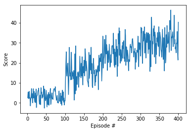

## DDPG Introduction
Deep Deterministic policy gradient (DDPG) is an off-policy learning method proposed in [Continuous Control with deep reinforcement learning](https://arxiv.org/abs/1509.02971)
paper. This algorithm learns the Q-function and the policy at the same time. It uses off-policy data and the Bellman equation to learn the Q-function, and uses the Q-function
to learn the policy.

### Description of the Implementation
My implementation for the DDPG agent follows [this](https://github.com/ShangtongZhang/DeepRL) repository. At first I tried to implement the agent and make it work with the
given unity environment. Then I tried to train for a few (100) episode with the default parameters of the [DDPG](https://arxiv.org/abs/1509.02971) paper. I did not get very
good result with this parameter settings. Then I came up with an idea of random search. 

I implementd a class *SampleHyperparameter* that will randomly choose these hyperparameters from a given list of values for each parameter. I sampled 10 set of different 
hyperparameters from this class and trained for 50 episode with this environment. I recorded the results. The results can be seen in the *Continuous_Control.ipynb* notebook. 
Then whichever hyperparameter set gives me the highest score over 50 episode, I chose that settings for my final training. 

### Result
With the final training with chosen hyperparameter I solved the environment within 400 episode. The result is as follows-

### Improvement Ideas
To improve the current implementation, we can search for best hyperparameter for some more sets of random sample. We can also increase the set for each parameter to include 
more cases. But it will increase the search time. 

On the other hand, algorithms like PPO, A3C and D4PG can get better result for this environment. Hopefully, I will implement them to compare with current performance in future.   
